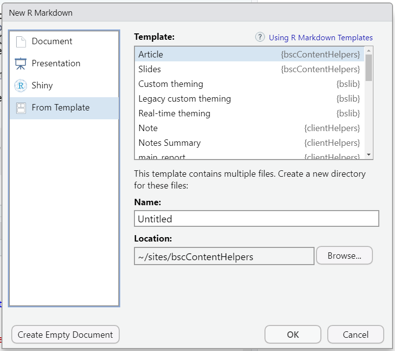
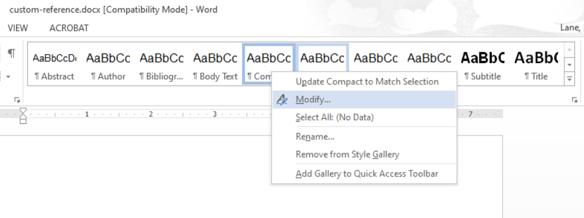
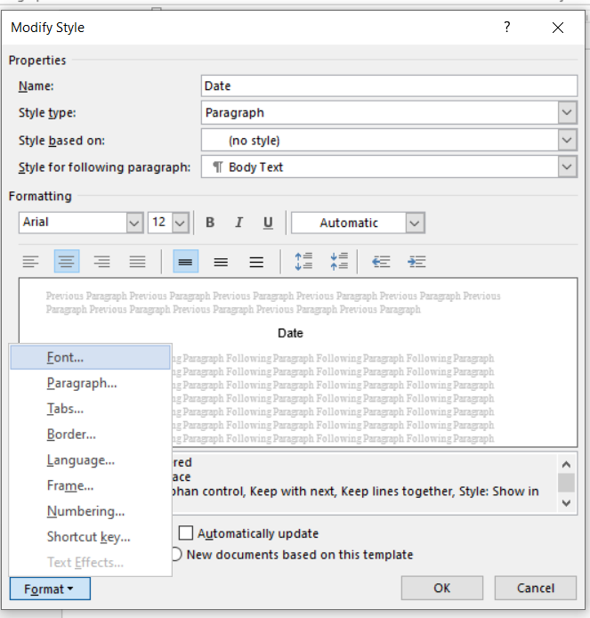
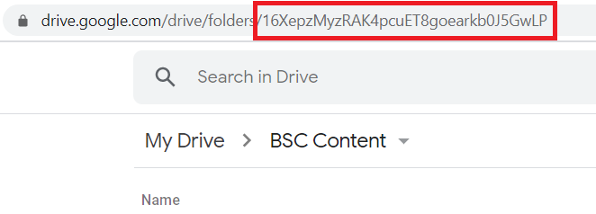

<!-- README.md is generated from README.Rmd. Please edit that file -->

```{r, include = FALSE}
knitr::opts_chunk$set(
  collapse   = TRUE,
  comment    = "#>",
  fig.path   = "man/figures/README-",
  out.width  = "100%",
  eval       = FALSE,
  fig.path   = "man/figures/"
)
```

# bscContentHelpers

<!-- badges: start -->
<!-- badges: end -->

`bscContentHelpers` provides templates and utilities for creating, editing, rendering, and storing documents for the UIC CCTS Biostatistics Core.

## Quick Start

### Install Software and R Packages

The primary workflow described here relies on [R](https://www.r-project.org/) and [RStudio](https://www.rstudio.com/), so be sure to install those first. Workarounds to RStudio are possible but probably not worth the hassle.

You can install the development version of `bscContentHelpers` from [Github](https://github.com/) with:

```{r, eval = FALSE}
devtools::install_github("rmlane/bscContentHelpers")
```

Note that this package isn't on CRAN, so updates won't be picked up by running `update.packages()`. However, once it's installed, you should be able to run `devtools::update_packages()`.

The current package relies on several underlying packages and software products (pandoc, `rmarkdown`, `bookdown`, a LaTeX engine). These should be automatically installed with RStudio and `bscContentHelpers`. If you run into trouble, you can install manually:

```{r}
# install R markdown
install.packages('rmarkdown')

# install the TinyTex LaTeX engine
install.packages('tinytex')
tinytex::install_tinytex()
```

### Create a Draft 

To use the RStudio `New File` add-in to create a document draft, navigate to `File > New File > R Markdown... > From Template`. Select one of the templates from the `bscContentHelpers` package (for example, Article or Slides). 



You can also create a new by manually calling `rmarkdown::draft()`:

```{r, eval = FALSE}
rmarkdown::draft("my_file_name.Rmd", template = "article", package = "bscContentHelpers")
```

Currently available templates and documents in this package:

```{r, eval = TRUE, echo = FALSE, results = 'asis'}

# get a list of current templates...
templates <- paste(
	"*", 
	rmarkdown::available_templates(package = "bscContentHelpers", full_path = FALSE)
	)

# and display
cat(templates, sep = "\n")

```

### Edit

Do a little editing, making use of [markdown syntax](https://www.markdownguide.org/basic-syntax/) and [R code chunks](https://rmarkdown.rstudio.com/lesson-3.html).

You can also edit fields in the YAML header or leave them as is.

### Knit

Convert the .Rmd draft to a formatted HTML document by clicking RStudio's `Knit` button or using the `Ctrl + Shift + K` keyboard shortcut. The document is ready for previewing or sharing. 

There are many other output file types (.docx, .pptx, .pdf) and formats possible. [See below] for details.


### For More Detail...

The internet is full of great explanations of what R Markdown is, how to use it, and how to extend it. Some references: 

* [R Markdown: The Definitive Guide](https://bookdown.org/yihui/rmarkdown/)
* [R Markwod Cookbook](https://bookdown.org/yihui/rmarkdown-cookbook/)
* [The Epidemiologist R Handbook](https://epirhandbook.com/en/reports-with-r-markdown.html)


## A Note About "Templates"

This package contains several document templates--that is, boilerplate outlines for tipsheets, generic articles, slide presentations, and more. These are in a subfolder called `templates` and can be accessed with the `rmarkdown::draft()` function. 

Perhaps confusingly, this package *also* contains several full-fledged pieces of frequently used content, also stored in `templates`. For example, an R Markdown version of the REDCap Terms of Use document can also be summoned by calling `rmarkdown::draft()`. For example, to create fresh pdf version of the Terms of Use in a specific format, generate a copy of the file:

```{r, eval = FALSE}
rmarkdown::draft("my-terms-copy", template = "redcap-terms-of-use", package = "bscContentHelpers")
```

Then update the YAML header to refer to the format and knit. 

This process makes sure that any copies of the document are based on one standardized, agreed-upon source, maintained within the `bscContentHelpers` package. You can edit the copy you generate in this way, but remember that any edits will be downstream of the source file stored in this package. If you want to edit the source (and any future copies based on the source)--for example, to correct a spelling error or to add a new section--you will need to edit the template by editing the `bscContentHelpers` package itself. The change will be distributed to any package users when they visit the GitHub repository or update their local copy of the package via `devtools::update_packages()` or similar.


## Under the Hood

The document development and rendering process relies on three files: [an .Rmd template](#rmd-template), [an output format](#output-format), and [a knit function](#knit-function).

### A .Rmd Template

At its most basic, an .Rmd template is a sample file, written in R Markdown, that may include standard headers, sample code, or boilerplate text. Templates defined in this package include:

* Article. This could be used for a tipsheet or other short article.
* Slides. This is set up to create a Powerpoint document.

Create a document using each of these template types and study the YAML header blocks, surrounded by three ticks (`---`). These settings determine document metadata (title, date, author) and output options (output_file, output_dir). 

### An Output Format

This is an R function that defines the file extension (e.g., docx, html) and the look and feel of the final document. It should be referenced in the YAML header of the Rmd document. Each format has default settings, some of which can be customized at the document level.

One Rmd file can be knit to multiple output formats simultaneously. To allow for this, include all outputs under `output:` in the YAML header. 

Document types defined in this package:

* `html_draft`. This can be used while developing content to avoid focusing too much on the final aesthetic details. Customizations: 
  * `toc`. Include a table of contents at the start of the document?
  * `theme`. Name of the CSS style to use. Defaults to a plain, clean style.
* `pptx_presentation`
  * `theme`
* `word_document`
  * `theme`
  * `toc`

Note that you can also use output formats defined outside this package if you prefer. `rmarkdown` has many nice formats built in, and there are dozens of other packages out there.


TODO: 

* pdf_document
* html_webpage (or md_webpage) -- for static site
  - [ ] consider whether this needs a separate knit function

### A Knit Function {#knit-function}

This controls the behavior of the knit button; in other words, it determines how the Rmd draft gets turned into the pdf (or html or docx or pptx) document.

Currently, all custom in this package templates use the same knit function (`bsc_knit()`). It must be explicitly mentioned in the YAML metadata of your Rmd file (and is included in all templates). If it's left out, your document will be knit using `rmarkdown`'s default knit behavior. 

All arguments passed to the knit function have defaults, but some can be updated by explicitly setting parameters in the YAML header. These include:

* `output_file: NULL`. This sets the output document name (minus the file extension). This will be the same for all output formats. If not explicitly set, it will default to the document title, minus spaces and special characters.
* `output_dir: NULL`. This sets the location where output documents are produced. Defaults to the same directory as the Rmd source. If stating explicitly, use a reference relative to the knit location.
* `dated_file: FALSE`. Append the date to the end of the file name?
* `file_date: Sys.Date()`. Date to be appended to the end of the file name, if applciable. Defaults to today's date but can be explicitly overridden. To avoid errors, pass as a date object.

TODO: knitting for website [html/md (with subfolder code snippet appended) plus pdf] 

## Other Helpful Tips

By default, documents refer to an external bibliography, held in `references.bib`. Add references in Bibtex format. Reference them as [@source].

## Enhancing This Package

The sections below explain how to structure new templates, formats, and more. The instructions don't go into detail about principles of package development or version control, but please keep these things in mind! It's a good idea to make changes on a development branch and test them before committing them to the master branch (i.e., the source of the distributed package). For more about package development, see the [R Packages book](https://r-pkgs.org/Introduction.html). For more about GitHub and version control, see the [GitHub docs](https://docs.github.com).

### Create a New Template (or Source Document) in This Package

TODO: expand to a vignette

*See the note above about templates (e.g., "article") and source documents (e.g., REDCap Terms of Use). Though these categories of Rmd files are conceptually different, they're created, stored, accessed, and edited in the same way.*

#### Step 0 [Optional but Recommended]: Sync and Switch Branches
Sync the remote repository (i.e., the current version of the files on GitHub) with your local copy. Then create and switch to a new development branch.

```
$ git fetch
$ git pull
$ git checkout -b new-working-branch
```

#### Create the Template
Generate a new Rmd template and supporting structures by calling `use_rmarkdown_template()`, part of the `usethis` package. A template should describe a type of document; for example, you might create a template for an article or for a slide presentation.

```{r, eval = FALSE}
usethis::use_rmarkdown_template("Article")
```

You'll see some messages in the console:

```
✔ Setting active project to '~/bscContentHelpers'
✔ Creating 'inst/rmarkdown/templates/article/skeleton/'
✔ Writing 'inst/rmarkdown/templates/article/template.yaml'
✔ Writing 'inst/rmarkdown/templates/article/skeleton/skeleton.Rmd'
```

#### Edit
Navigate to the newly created folder, located under `inst/rmarkdown/templates/article`. It should be structured as:


```
inst/rmarkdown/templates/article
|  template.yaml
|--skeleton/
|  |  skeleton.Rmd
```

The file `template.yaml` contains the template name and a few configurations. Edit the description, but otherwise this file can be left alone.

To edit the .Rmd template file (which will be the shell of any documents based on this template), open `skeleton/skeleton.Rmd`. This is where you should put any boilerplate text or section titles that will be available each time a new document is created based on the template. 

The header block, surrounded by three ticks (`---`), includes parameters that will be used when rendering the document to its final form. Some, like title and date, are placeholders and may be edited every time a new document is created. Others, like the output format and knit function, can be standardized in this document so they will be the same every time a document of this type is created. For more about formats and knit functions, see below. Some suggested settings:

```{r, eval = FALSE}
author: "UIC CCTS Biostatistics Core"
date: "`r format(Sys.Date(), '%B %d, %Y')`"
output: 
  bscContentHelpers::html_draft: default
  bscContentHelpers::word_document:
    toc: FALSE
    theme: "teal"
knit: bscContentHelpers::bsc_knit
```

Put supporting documents (e.g., image files or document-specific stylesheets that should be copied every time the template is used) in the `/skeleton` subfolder. Import an image:

```

```

Note that you don't need to include files that are part of the output format (like header logos or stylesheets). Those should be in `inst/rmd_files` and referred to in R scripts by `system.file("rmd_files/filename.ext", package = "bscContentHelpers")`.

#### Preview

Knit the file to see what the final version will look like. Use the `knit` button or the `Ctrl+Shift+K` shortcut.

After you preview the file, be sure to delete the output (e.g., skeleton.html).

#### Deploy

Do any package checks you want (e.g., run `devtools::check()` or `devtools::load_all()`). When you're happy, commit and push the changes. 

#### Merge [Recommended - If On a Development Branch]

On GitHub, compare the changes and initiate a pull request from the development branch to the main/master branch. Merge. Confirm. Delete the development branch.

Locally, switch to the master branch. Sync the changes. Then delete the local version of the development branch.

```
git checkout main
git fetch
git pull
git branch -d new-working-branch
```


#### For More...

See the excellent [R Markdown book](https://bookdown.org/yihui/rmarkdown/document-templates.html) for more detail on document templates.

* TODO: more about updating the package and templates. Simple guides:
	* https://catbirdanalytics.wordpress.com/2021/08/16/how-to-create-a-custom-r-markdown-template/
	* https://cran.r-project.org/web/packages/indiedown/vignettes/walkthrough.html

### Create a New Output Format

An Rmd template defines the content and structure of a document. Once the content has been developed, one or more formats can be applied. Formats define the type of file (e.g., .docx or .pptx) and the look and feel (e.g., colors, fonts, headers) of the final product. 

Note that multiple different formats can be applied to the same template. For example, you might have an .Rmd report that can be knit as an html draft during content development. The final version could be knit to a pdf with custom headers, fonts, and colors.

A Rmd output "format" is actually a piece of R code that defines output behavior and specs. Initiate the new format file by calling:

```{r, eval = FALSE}
# create a new format; this is where you'll define output type and look & feel 
usethis::use_r("pptx_presentation")
```

In the format file, create a function that defines the format. In most cases, this function will base R Markdown format with some custom options.

```{r, eval = FALSE}
uic_pptx <- function() {
 
  # call the base powerpoint_presentation format
  rmarkdown::powerpoint_presentation(
    reference_doc = "my_reference.pptx"
  )
   
}
```

Supporting files to be called by the format function should be put in `inst/rmd_files/`. This way, they'll be installed with the `bscContentHelpers` package and will be accessible to any users of your format function. See examples in `R/` (e.g., `html_draft()`) or, again, the [R Markdown documentation](https://bookdown.org/yihui/rmarkdown/new-formats.html) for more examples. 

### Create a New Reference Doc

You might want to do this to set up a new set of styles but leave an output format otherwise the same. The reference doc might be a reference.docx, a reference.ppt, or a reference.css.

#### Docx

It's best to start from a fresh pandoc template. In the terminal (not the R console):

```
$ pandoc -o custom-reference.docx --print-default-data-file reference.docx
```

Open the new file (`custom-reference.docx`). Built-in styles are listed in the ribbon. To edit a style, right-click its name and select `Modify...`. Change font or paragraph options or add header images. Later documents based on this reference document will have the updated styles applied.





Save the reference document in this package's `inst/rmd_files/` directory with a descriptive name. Check and reinstall the package. The name will become a theme name that can be referenced in the yaml header (e.g., reference `teal.docx` with the yaml option `theme: "teal"`).

Note that just changing the formatting of the text in the document, without editing the underlying style, **will not** extend to documents based on this template.

#### .pptx

*TODO: Edit the slide masters.*

#### .css

*TODO: Add a css stylesheet.*


### Create a New Knit Function

*TODO*

<!-- ## Google Drive Integration -->

<!-- *TODO: Think through and expand on this section and process.* -->

<!-- Templates and documents are stored in a [BSC Content folder on Google Drive](https://drive.google.com/drive/folders/16XepzMyzRAK4pcuET8goearkb0J5GwLP). They can be accessed through RStudio via the [`googledrive` package](https://googledrive.tidyverse.org/).  -->

<!-- Reading and writing files requires allowing the R package to access your Google Drive account. To ensure you have access, run: -->

<!-- ```{r, eval = FALSE} -->
<!-- # if necessary, install the package -->
<!-- install.packages("googledrive") -->

<!-- # view files and folders in the BSC Content Google Drive folder -->
<!-- googledrive::drive_ls(as_id(gd_id), recursive = FALSE) -->
<!-- ``` -->

<!-- You should be sent to a login screen. Authorize Tidyverse API to access your Google account. -->

<!-- Files can be saved to and read from specific Google Drive locations. Every Google Drive folder has a unique id, equivalent to the id used in the URL in a web browser. -->

<!--  -->
<!-- To look up the id of a subfolder (nested within BSC Content), use `find_gd_id()` -->

<!-- ```{r} -->
<!-- find_gd_id("Templates") -->
<!-- ``` -->

<!-- Any time an .Rmd template is updated in this package, generate a fresh copy and send it to the `BSC Content/Templates` folder. This will overwrite the existing copy on Google Drive. -->

<!-- ```{r} -->
<!-- upload_template_to_drive("article") -->
<!-- ``` -->


<!-- TODO -->

<!-- - [ ] When, where, and how should files should be uploaded to Drive? -->
<!-- - [ ] Set target (dynamic) locations for outputs -->
<!-- - [ ] Wite a `knit_template` function that will regenerate Rmd templates in Drive -->
<!-- - [ ] ~~Workflows and functions to convert from one template to another~~ -->
<!-- - [ ] connect document titles to file names (and calls to `rmarkdown::draft()`) -->
<!-- - [x] where to set output doc parameters for use in knit fxn? -->

