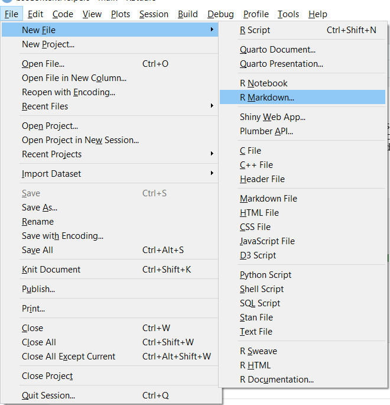
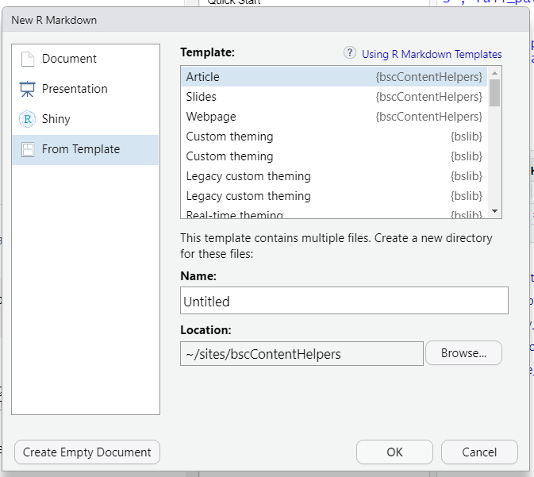

- [bscContentHelpers](#bsccontenthelpers)
  - [Quick Start](#quick-start)
    - [Install Software and R
      Packages](#install-software-and-r-packages)
    - [Create a Draft](#create-a-draft)
    - [Edit](#edit)
    - [Knit](#knit)
    - [For More Information…](#for-more-information)

<!-- README.md is generated from README.Rmd. Please edit that file -->

# bscContentHelpers

<!-- badges: start -->
<!-- badges: end -->

`bscContentHelpers` provides templates and utilities for creating,
editing, and rendering documents for the UIC CCTS Biostatistics Core.

## Quick Start

This section walks through the process of creating a draft R Markdown
document from a template, customizing the document, and “knitting” it to
an output format.

### Install Software and R Packages

The primary workflow described here relies on
[R](https://www.r-project.org/) and [RStudio](https://www.rstudio.com/),
so be sure to install those first. Workarounds to RStudio are possible
but probably not worth the hassle. You’ll also want to install the
`devtools` package:

``` r
install.packages("devtools")
```

You can install the development version of `bscContentHelpers` from
[Github](https://github.com/) with:

``` r
devtools::install_github("UIC-CCTS-BSC/bscContentHelpers")
```

Note that this package isn’t on CRAN, so updates won’t be picked up by
running `update.packages()`. However, once it’s installed, you should be
able to run `devtools::update_packages()`.

The current package relies on several underlying packages and software
products (pandoc, `rmarkdown`, `bookdown`, a LaTeX engine). These should
be automatically installed with RStudio and `bscContentHelpers`. If you
run into trouble, you can install manually:

``` r
# install R markdown
install.packages('rmarkdown')

# install the TinyTex LaTeX engine
install.packages('tinytex')
tinytex::install_tinytex()
```

### Create a Draft

This package contains several document templates–that is, boilerplate
outlines for tipsheets, generic articles, slide presentations, and more.
These are in a subfolder called `templates` and can be accessed with the
`rmarkdown::draft()` function.

Currently available templates in this package:

- article
- bibliography
- landing_page
- slides
- webpage

To create a document draft using the RStudio `New File` add-in, navigate
to `File > New File > R Markdown... > From Template`. Select one of the
templates from the `bscContentHelpers` package (for example, Article or
Slides).

<figure>

<figcaption aria-hidden="true">Create a new R Markdown
document.</figcaption>
</figure>

<figure>

<figcaption aria-hidden="true">Create a new doc from a
template.</figcaption>
</figure>

You can also create a new draft by manually calling `rmarkdown::draft()`
with the template and package name as arguments:

``` r
rmarkdown::draft("my_file_name", template = "article", package = "bscContentHelpers")
```

### Edit

Study the top section of the document, called the YAML header. Feel free
to edit these options or leave them as is. [See below](#under-the-hood)
for more information.

Below the YAML header (after the closing `---` marks) is the document
body. Do a little editing of the content, making use of [markdown
syntax](https://rmarkdown.rstudio.com/authoring_basics.html) and [R code
chunks](https://rmarkdown.rstudio.com/lesson-3.html). The template
contains tips for content formatting.

### Knit

Each template has a default output format, usually explicitly named in
the YAML header block. For example, the `article` template defaults to
`bscContentHelpers::html_draft`. Convert the .Rmd draft to this output
format by clicking RStudio’s `Knit` button or using the
`Ctrl + Shift + K` keyboard shortcut. An HTML document will be generated
and should open automatically.

HTML drafts are good for previewing content as you develop it, but there
are many other output file types (.docx, .pptx, .pdf) and formats
possible. Try changing the YAML `output` option to
`bscContentHelpers::pdf_document` and knit the document again. To knit
to multiple formats simultaneously, list them all in the header.

### For More Information…

The internet is full of great explanations of what R Markdown is, how to
use it, and how to extend it. Some references:

- [R Markdown: The Definitive
  Guide](https://bookdown.org/yihui/rmarkdown/)
- [R Markdown Cookbook](https://bookdown.org/yihui/rmarkdown-cookbook/)
- [The Epidemiologist R
  Handbook](https://epirhandbook.com/en/reports-with-r-markdown.html)
