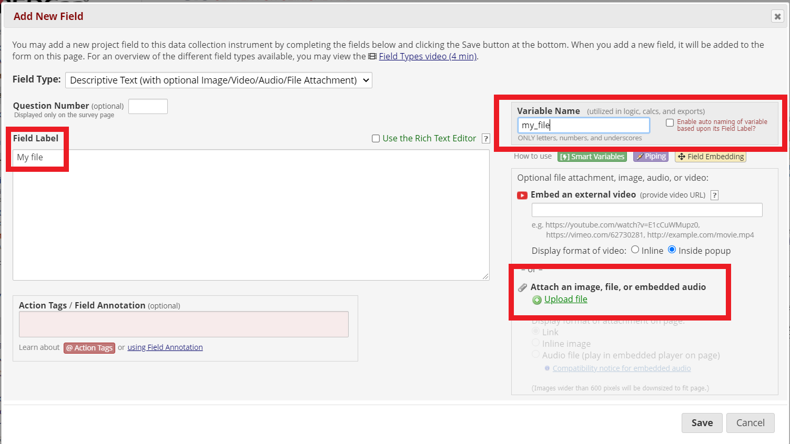
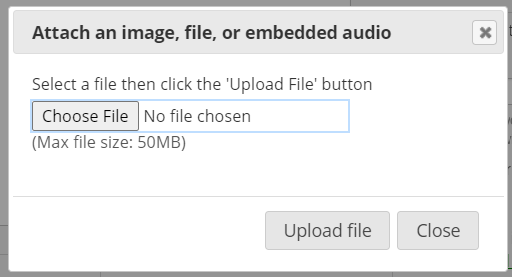
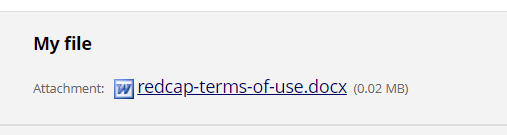

```{r setup, include=FALSE}
knitr::opts_chunk$set(echo = FALSE)
```

To share a file through a data collection instrument, create a Descriptive Text field.


Give the field a name and a label. Then click "Upload file." 



Choose a file to upload from your computer's file directory. Click "Upload file." Then save the changes.



Your file will appear as a download link on your survey or data collection instrument.


